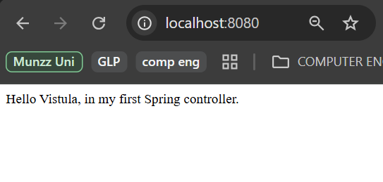
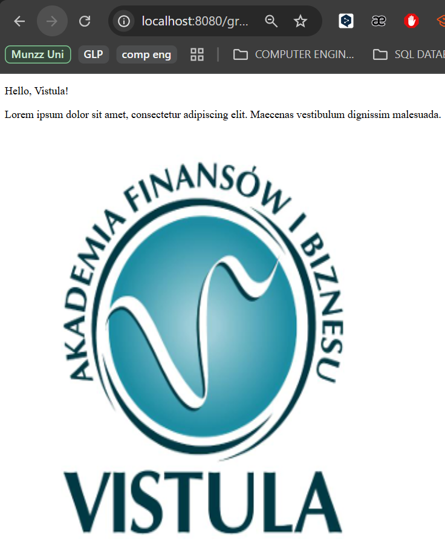

# Task 1 Spring Boot Application

## Project Setup
This is a frontend Spring Boot project, initialised using Spring Initializr with Maven, Java 17, and dependencies for Spring Web and Thymeleaf.

## Code Explanation
The logic is handled in `HelloController.java` using the `@Controller` annotation:

*   **Root Endpoint (`/`):** Returns a raw string directly to the browser.
*   **Greeting Endpoint (`/greeting`):** Uses `@RequestParam` to take a name from the URL and passes it to a Thymeleaf template using the `Model` object.

The frontend is a Thymeleaf template (`greeting.html`) that dynamically displays the name and the university logo from the static resources.

## Screenshots of Running Application
### Root Response

### Dynamic Greeting

